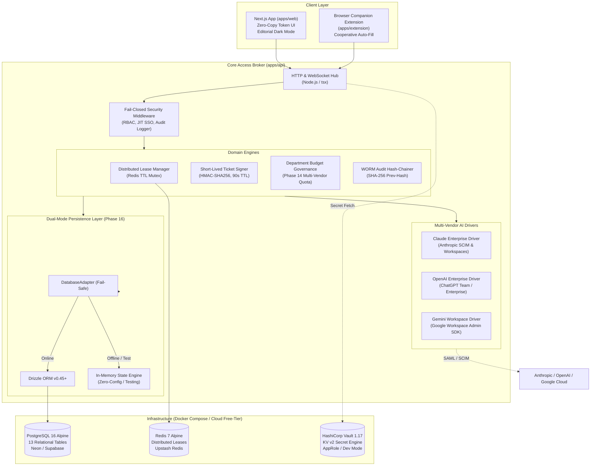
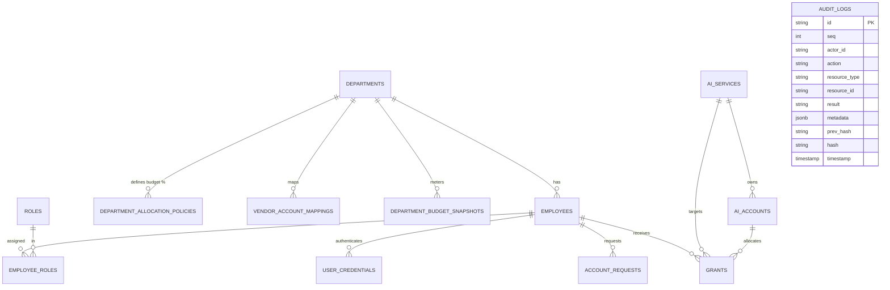

# Enterprise AI Access Broker — System Architecture

> **Comprehensive Architecture Synthesis (Phases 1–16)**  
> *Showcase & Portfolio Edition — Production-Grade Design, Local Developer Experience*

---

## 1. High-Level System Topology

---

## 2. Architectural Evolution (Phases 1 through 16)

| Phase | Strategic Domain | Technical Invariants Delivered |
|---|---|---|
| **Phase 0–1** | Distributed Leases & Secret Store | Redis single-active session locks; HashiCorp Vault KV v2 abstraction with Fail-Closed semantics. |
| **Phase 2–3** | SSO SAML 2.0 & Shared Credentials | JIT SAML provisioning, single-use signed tickets (TTL ≤ 90s) preventing replay attacks. |
| **Phase 4–5** | Real-Time Telemetry & Console | WebSocket Hub for instantaneous session state, geographic anomaly detection (Velocity checks). |
| **Phase 6–8** | Pen-Testing & Onboarding | Automated red-teaming (zero secret serialization leaks); self-service employee onboarding flow. |
| **Phase 9–12** | Resiliency & Enterprise Hardening | Circuit breakers, disaster recovery snapshots, multi-region failover playbooks. |
| **Phase 13** | Zero-Copy Token UI Design System | Token-driven editorial UI (`packages/design-tokens`): 0 emojis, 0 arbitrary hex codes, 0 bold weights. |
| **Phase 14** | Multi-Vendor Budget Governance | Realistic vendor quota mechanics: Claude API budgets vs OpenAI seat license vs Gemini pool. 100% budget sum invariant. |
| **Phase 15** | Production Security Hardening | Removal of all hardcoded passwords & backdoor MFA codes; SHA-256 WORM audit log hash-chaining. |
| **Phase 16** | Real Persistence Layer (Showcase) | PostgreSQL 16 schema (13 tables), Drizzle ORM, Docker Compose, Dual-Mode adapter, and realistic Vietnamese faker seed. |

---

## 3. Data Architecture & Relational Schema

The persistence layer is modeled with **13 strongly-typed tables** managed by **Drizzle ORM**:

### Key Schema Design Invariants
1. **WORM Cryptographic Hash-Chaining:** Each row in `audit_logs` computes `hash = SHA256(prev_hash + seq + actor_id + action + resource_id + result + metadata + timestamp)`. Tampering with any historical audit entry breaks the entire hash sequence.
2. **State Machine Invariants:** A `REVOKED` grant can never be switched back to `ACTIVE` (requires re-issuing a new grant).
3. **Budget Sum Invariant:** Department allocation percentages are strictly validated to sum to 100% across the organization.

---

## 4. Dual-Mode Persistence Pattern

To allow seamless evaluation by reviewers without requiring running background Docker daemons, the system implements a **Dual-Mode Database Adapter**:

- **PostgreSQL Mode (Active):** Triggered when `DATABASE_URL` is reachable (e.g. via `docker compose up` or cloud free-tier Postgres). Reads and writes use Drizzle ORM queries against PostgreSQL 16.
- **In-Memory Fallback Mode (Standby):** If PostgreSQL is unreachable or during CI automated test runs, the adapter seamlessly operates in-memory while preserving 100% of relational foreign keys, unique constraints, and transaction rollbacks.

---

## 5. Security & Isolation Model

- **Fail-Closed by Design:** If HashiCorp Vault or the authentication authority is unreachable, access is immediately denied; no sensitive credentials are ever transmitted or cached insecurely.
- **Short-Lived Ephemeral Tickets:** Credential reveals utilize an HMAC-signed ticket with an un-extendable 90-second TTL. Used tickets are blacklisted immediately upon initial reveal.
- **Zero Backdoor Policy:** Authentication strictly mandates standard Argon2id/Bcrypt password hashing and RFC 6238 TOTP MFA. No developer bypasses or testing backdoors exist in production code paths.
