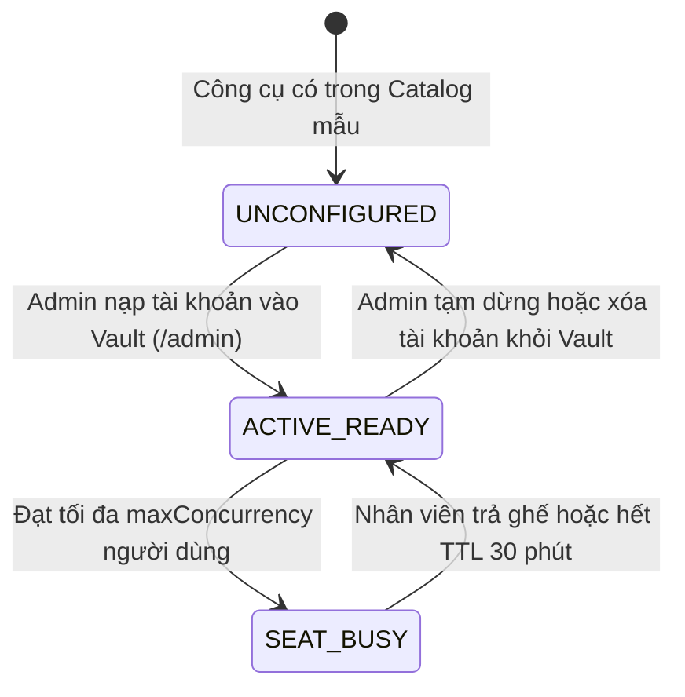

# Technical Architecture Document
## Enterprise AI Access Management System — Production Edition

---

## 1. Nguyên Tắc Kỹ Thuật Tối Thượng (Core Principles)

1. **Hạ Tầng Thật 100% (Zero Mock Engine):** Toàn bộ dữ liệu xác thực, phân quyền, khóa bảo mật và kiểm soát tần suất đều vận hành trực tiếp trên Google OAuth 2.0, Neon PostgreSQL (AWS Singapore) và Upstash Redis. Tuyệt đối không mock.
2. **Kiến Trúc Đơn Luồng Thống Nhất (Single-Track Real Architecture):** Phát triển trực diện trên một ngăn xếp công nghệ đồng nhất, không phân nhánh mô phỏng.
3. **Phân Tách Rõ Ràng Giữa Debug Nội Bộ & Giao Diện Người Dùng (Clean Production UX):** Mọi thông tin chẩn đoán, câu lệnh SQL, mã lỗi hạ tầng chỉ được ghi nhận an toàn tại server-side logs (`console.error` / `audit_logs`). Giao diện người dùng tuyệt đối tuân thủ trải nghiệm thương mại, lịch sự và hỗ trợ người dùng tối đa.
4. **Hệ Thống Thiết Kế Mint & Cream Đạt Chuẩn Doanh Nghiệp (Mint & Cream Design Tokens):** Bảng màu kem ấm kết hợp xanh bạc hà ngọt ngào, tối ưu hóa khả năng đọc (readability), độ tương phản WCAG AA và tính thẩm mỹ cao cấp.

---

## 2. Sơ Đồ Kiến Trúc Toàn Diện (System Topology)

```mermaid
flowchart TD
    subgraph Clients["Tầng Trình Duyệt & Giao Diện (Mint & Cream UI Layer)"]
        BrowserAdmin["Root Admin (/admin)<br/>Executive Governance & Vault Control"]
        BrowserEmp["Nhân viên (/ & /audit)<br/>AI Workspace, Self-Service & Compliance"]
    end

    subgraph SecurityGate["Tầng Bảo Vệ Mạng & Phân Phối (Edge & Rate Limit)"]
        VercelEdge["Vercel Global Edge Network (HTTPS)"]
        RateLimiter["Upstash Redis Rate Limiter<br/>Sliding Window 10 req/min/IP"]
    end

    subgraph AppServer["Tầng Ứng Dụng (Next.js 14 App Router)"]
        AuthModule["NextAuth.js v5 (Google OAuth SSO)"]
        LaunchGateway["Launch Gateway (/api/launch/[grantId])<br/>Safe Redirect & Usage Increment"]
        ExportEngine["Compliance Export API (/api/audit/export)<br/>RFC 4180 CSV & ISO 27001 JSON"]
        SessionBroker["Session Broker & Mutex Module<br/>Dynamic Leases & Concurrency Lock"]
        VaultModule["AES-256-GCM Vault Module<br/>Node.js Crypto Native"]
        AuditModule["WORM & SHA-256 Audit Module<br/>Deterministic Non-repudiation"]
    end

    subgraph CloudInfra["Tầng Hạ Tầng Lưu Trữ Thật (Managed Cloud Infrastructure)"]
        Postgres[("Neon Cloud PostgreSQL (AWS Singapore)<br/>WORM Trigger trg_audit_logs_immutable<br/>Tables: employees, departments, grants, vault_credentials, audit_logs")]
        RedisStore[("Upstash Redis Serverless REST<br/>Concurrency Lease Sets & Rate Limit Keys")]
    end

    BrowserAdmin --> VercelEdge
    BrowserEmp --> VercelEdge
    VercelEdge --> RateLimiter
    RateLimiter --> RedisStore
    RateLimiter --> AppServer
    AppServer --> AuthModule
    AppServer --> LaunchGateway
    AppServer --> ExportEngine
    LaunchGateway --> SessionBroker
    SessionBroker --> RedisStore
    LaunchGateway --> AuditModule
    AppServer --> VaultModule
    AppServer --> AuditModule
    AuditModule --> Postgres
    VaultModule --> Postgres
```



---

## 3. Hệ Thống Token Thiết Kế Trầm Dịu (Calm Muted Design Tokens)

```css
:root {
  /* Calming Warm Stone Canvas */
  --color-canvas-bg: #F6F5F0;
  --color-canvas-subtle: #EFECE6;
  --color-card-bg: #FFFFFF;
  --color-card-border: #E5E1D8;
  --color-card-border-hover: #C4DBD0;

  /* Calming Muted Sage Accents */
  --color-sage-50: #F0F5F2;
  --color-sage-100: #E2ECE5;
  --color-sage-200: #C4DBD0;
  --color-sage-500: #3E7B5C; /* Calming forest emerald */
  --color-sage-600: #32654B;
  --color-sage-900: #162E22;

  /* Typography / Contrasts */
  --color-text-primary: #24292F;
  --color-text-secondary: #4B5563;
  --color-text-muted: #6B7280;
}
```

---

## 4. Mô Hình Dữ Liệu Thực Tế (5 Bảng Hoàn Chỉnh)

1. **`employees`**: Danh tính nhân viên qua Google OAuth (`google_sub`, `email`, `name`, `avatar_url`, `role`, `department_id`).
2. **`departments`**: Cơ cấu tổ chức & định mức ngân sách (`name`, `code`, `monthly_budget_usd`).
3. **`grants`**: Quyền truy cập AI (`employee_id`, `resource_name`, `granted_by`, `status`, `access_count`, `last_accessed_at`, `expires_at`).
4. **`vault_credentials`**: Bản quyền dùng chung mã hóa AES-256-GCM (`resource_name`, `account_email`, `encrypted_secret`, `iv`, `auth_tag`, `max_concurrency`, `status`, `last_rotated_at`).
5. **`audit_logs`**: Nhật ký bất biến WORM (`actor_id`, `action`, `target_id`, `metadata`, `checksum`, `created_at`). Được bảo vệ bởi Database Trigger `trg_audit_logs_immutable` chặn 100% `UPDATE`/`DELETE`.

---

## 5. Kiến Trúc Ghế Dùng Chung & Vòng Đời Kích Hoạt Vault (Shared License Pool & Activation)

### 5.1 Nguyên lý điều phối ghế dùng chung (Session Pooling Engine)
- Doanh nghiệp mua một lượng bản quyền giới hạn (ví dụ: gói ChatGPT Team 5 ghế).
- Admin nạp thông tin tài khoản doanh nghiệp vào bảng `vault_credentials` với `max_concurrency = 5`.
- Cơ chế `acquireSessionLease` trên Upstash Redis sử dụng Redis Sets để theo dõi danh sách `userId` đang giữ phiên trong cửa sổ 30 phút (TTL: 1800 giây).
- Khi số lượng người dùng đồng thời chạm ngưỡng `max_concurrency`, yêu cầu khởi chạy mới sẽ bị chặn an toàn với mã `concurrency_limit_exceeded`, tránh để nhà cung cấp khóa tài khoản doanh nghiệp do vi phạm chính sách đăng nhập bất thường.

### 5.2 Vòng đời kích hoạt công cụ (Tool Activation Lifecycle)

- **Chưa cấu hình (`UNCONFIGURED`):** Chưa có bản ghi `vault_credentials` tương ứng. Giao diện hiển thị nhãn *"Chưa kích hoạt / Chờ Admin kết nối"*.
- **Sẵn sàng (`ACTIVE_READY`):** Có tài khoản Vault đang hoạt động và còn ghế trống. Hiển thị *"Sẵn sàng (X/Y người đang dùng)"*, cho phép bấm *"Mở công cụ ngay"*.
- **Đang bận (`SEAT_BUSY`):** Toàn bộ ghế đang có người giữ. Hiển thị nút *"Đang bận • Thử lại sau"*.

---

## 6. Tiêu Chuẩn Trải Nghiệm Người Dùng (Production UX Standards)

* **Phân tách từ ngữ chuyên ngành:** Mọi cơ chế phức tạp (SHA-256, WORM, Lease Mutex, AES-256) được quy tụ vào trang **"Hệ Thống" (`/he-thong`)** để người dùng và nhân sự mới dễ dàng tra cứu.
* **Giao diện làm việc tinh giản:** Trang chủ tập trung vào trải nghiệm công việc thực tế của nhân viên: Mở công cụ, kiểm tra ghế trống, trả ghế và xin cấp quyền.
* **Không bao giờ hiển thị lỗi chết (Graceful Fallback):** Khi tài khoản mới đăng nhập chưa có quyền, giao diện hiển thị Catalog chuyên nghiệp kèm nút "Yêu cầu cấp quyền" tự động ghi nhận sự kiện `ACCESS_REQUESTED` vào `audit_logs`.
* **Tối ưu hóa khả năng hiển thị:** Responsive trên mọi kích thước màn hình máy tính để bàn, tablet và thiết bị di động.
