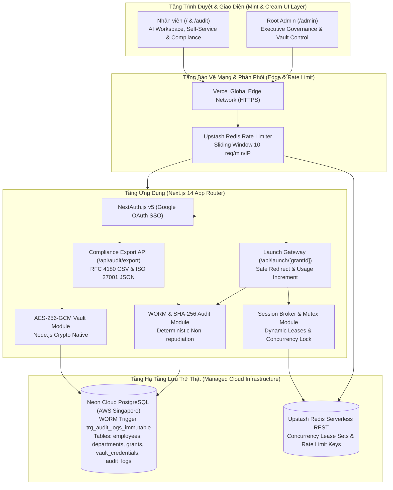

# Technical Architecture Document
## Enterprise AI Access Management System — Production Edition

---

## 1. Nguyên Tắc Kỹ Thuật Tối Thượng (Core Principles)

1. **Hạ Tầng Thật 100% (Zero Mock Engine):** Toàn bộ dữ liệu xác thực, phân quyền, khóa bảo mật và kiểm soát tần suất đều vận hành trực tiếp trên Google OAuth 2.0, Neon PostgreSQL (AWS Singapore) và Upstash Redis. Tuyệt đối không mock.
2. **Kiến Trúc Đơn Luồng Thống Nhất (Single-Track Real Architecture):** Phát triển trực diện trên một ngăn xếp công nghệ đồng nhất, không phân nhánh mô phỏng.
3. **Phân Tách Rõ Ràng Giữa Debug Nội Bộ & Giao Diện Người Dùng (Clean Production UX):** Mọi thông tin chẩn đoán, câu lệnh SQL, mã lỗi hạ tầng chỉ được ghi nhận an toàn tại server-side logs (`console.error` / `audit_logs`). Giao diện người dùng tuyệt đối tuân thủ trải nghiệm thương mại, lịch sự và hỗ trợ người dùng tối đa.
4. **Hệ Thống Thiết Kế Mint & Cream Đạt Chuẩn Doanh Nghiệp (Mint & Cream Design Tokens):** Bảng màu kem ấm kết hợp xanh bạc hà ngọt ngào, tối ưu hóa khả năng đọc (readability), độ tương phản WCAG AA và tính thẩm mỹ cao cấp.

---

## 2. Sơ Đồ Kiến Trúc Toàn Diện (System Topology)



---

## 3. Hệ Thống Token Thiết Kế Mint & Cream (Design Tokens Specification)

```css
:root {
  /* Warm Cream / Ivory Backgrounds */
  --color-canvas-bg: #FAF7F2;
  --color-canvas-subtle: #F4EFE6;
  --color-card-bg: #FFFFFF;
  --color-card-border: #EFE8DC;
  --color-card-border-hover: #D8CEBC;

  /* Sweet Mint & Emerald Accents */
  --color-mint-50: #ECFDF5;
  --color-mint-100: #D1FAE5;
  --color-mint-200: #A7F3D0;
  --color-mint-400: #34D399;
  --color-mint-500: #10B981;
  --color-mint-600: #059669;
  --color-mint-700: #047857;
  --color-mint-900: #064E3B;

  /* Typography / Contrasts */
  --color-text-primary: #1F2937;
  --color-text-secondary: #4B5563;
  --color-text-muted: #6B7280;
  --color-text-cream: #928B80;

  /* Functional Accents */
  --color-amber-soft: #FFFBEB;
  --color-amber-border: #FDE68A;
  --color-amber-text: #B45309;
}
```

---

## 4. Mô Hình Dữ Liệu Thực Tế (5 Bảng Hoàn Chỉnh)

1. **`employees`**: Danh tính nhân viên qua Google OAuth (`google_sub`, `email`, `name`, `avatar_url`, `role`, `department_id`).
2. **`departments`**: Cơ cấu tổ chức & định mức ngân sách (`name`, `code`, `monthly_budget_usd`).
3. **`grants`**: Quyền truy cập AI (`employee_id`, `resource_name`, `granted_by`, `status`, `access_count`, `last_accessed_at`, `expires_at`).
4. **`vault_credentials`**: Bản quyền dùng chung mã hóa AES-256-GCM (`resource_name`, `account_email`, `encrypted_secret`, `iv`, `auth_tag`, `max_concurrency`, `status`, `last_rotated_at`).
5. **`audit_logs`**: Nhật ký bất biến WORM (`actor_id`, `action`, `target_id`, `metadata`, `checksum`, `created_at`). Được bảo vệ bởi Database Trigger `trg_audit_logs_immutable` chặn 100% `UPDATE`/`DELETE`.

---

## 5. Tiêu Chuẩn Trải Nghiệm Người Dùng (Production UX Standards)

* **Không bao giờ hiển thị lỗi chết (Graceful Fallback):** Khi tài khoản mới đăng nhập chưa có quyền, giao diện hiển thị Catalog chuyên nghiệp kèm nút "Yêu cầu cấp quyền" tự động ghi nhận sự kiện `ACCESS_REQUESTED` vào `audit_logs`.
* **Thông báo phản hồi tức thì (Instant Feedback Toast & Modal):** Thao tác sao chép, cấp quyền, thu hồi, trả slot đều có chỉ báo loading và phản hồi rõ ràng.
* **Tối ưu hóa khả năng hiển thị:** Responsive trên mọi kích thước màn hình máy tính để bàn, tablet và thiết bị di động.
