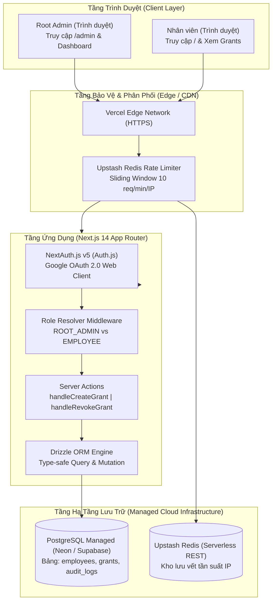

# Technical Architecture Document
## Enterprise AI Access Management System

---

## 1. Nguyên Tắc Kỹ Thuật Tối Thượng

1. **Hạ Tầng Thật 100%:** Tuyệt đối không triển khai bất kỳ module giả lập hay bộ nhớ đệm giả lập (in-memory driver). Toàn bộ luồng dữ liệu đi qua Google OAuth 2.0 thật, PostgreSQL thật và Upstash Redis thật.
2. **Kiến trúc Đơn Luồng Thống Nhất:** Dự án phát triển theo một lộ trình kỹ thuật duy nhất, không duy trì các nhánh kiến trúc song song hay khái niệm phân tách tạm thời.
3. **Fail-Closed Security:** Mọi route quản trị, thao tác cấp phát và thu hồi tài nguyên đều kiểm tra phân quyền chặt chẽ trên máy chủ (Server-side Route Guard & Server Actions). Mặc định từ chối khi không thỏa mãn vai trò.
4. **Append-Only Audit Trail:** Mọi sự kiện xác thực và thay đổi trạng thái phân quyền đều ghi nhận bản ghi kiểm toán vĩnh viễn với thông tin tác tử (`actor_id`) và mục tiêu (`target_id`).

---

## 2. Sơ Đồ Kiến Trúc Hệ Thống (System Topology)



---

## 3. Mô Hình Dữ Liệu Thực Tế (Data Model)

Mô hình dữ liệu hiện tại chỉ bao gồm 3 bảng đang thực sự tồn tại trong hệ thống di chuyển cơ sở dữ liệu (`scripts/migrate.ts` và `apps/web/src/db/schema.ts`):

```
employees (
    id UUID PRIMARY KEY DEFAULT gen_random_uuid(),
    google_sub VARCHAR(255) NOT NULL UNIQUE,
    email VARCHAR(255) NOT NULL,
    name VARCHAR(255),
    avatar_url TEXT,
    role VARCHAR(50) NOT NULL DEFAULT 'EMPLOYEE',
    created_at TIMESTAMP WITH TIME ZONE NOT NULL DEFAULT NOW()
)

grants (
    id UUID PRIMARY KEY DEFAULT gen_random_uuid(),
    employee_id UUID NOT NULL REFERENCES employees(id) ON DELETE CASCADE,
    resource_name VARCHAR(255) NOT NULL,
    granted_by VARCHAR(255) NOT NULL,
    status VARCHAR(50) NOT NULL DEFAULT 'ACTIVE',
    created_at TIMESTAMP WITH TIME ZONE NOT NULL DEFAULT NOW(),
    expires_at TIMESTAMP WITH TIME ZONE
)
INDEXES: idx_grants_employee_id, idx_grants_status

audit_logs (
    id UUID PRIMARY KEY DEFAULT gen_random_uuid(),
    actor_id VARCHAR(255),
    action VARCHAR(100) NOT NULL,
    target_id VARCHAR(255),
    metadata JSONB,
    created_at TIMESTAMP WITH TIME ZONE NOT NULL DEFAULT NOW()
)
```

> **Ghi chú kiến trúc:** Không thiết kế trước các bảng chưa có hạ tầng thật (như `ai_accounts`, `secret_stores`). Các bảng mới chỉ được thêm vào khi có yêu cầu tích hợp thực tế.

---

## 4. Công Nghệ & Lý Do Lựa Chọn (Tech Stack)

| Tầng | Công nghệ | Lý do lựa chọn |
|---|---|---|
| **Xác thực (Authentication)** | NextAuth.js (Auth.js v5) + Google Provider | Chuẩn bảo mật công nghiệp, cơ chế JWT ký bảo vệ toàn vẹn bằng khóa bí mật, không lưu mật khẩu thô. |
| **Ứng dụng Fullstack** | Next.js 14+ App Router & Server Actions | Xử lý logic máy chủ an toàn, loại bỏ nhu cầu duy trì backend rời rạc trong phạm vi hiện tại. |
| **Cơ sở dữ liệu (Database)** | PostgreSQL (Neon / Supabase managed) | Hạ tầng đám mây chuẩn có chuỗi kết nối thật, hỗ trợ tính năng connection pooling serverless. |
| **Truy vấn Dữ liệu (ORM)** | Drizzle ORM | Gọn nhẹ, hỗ trợ type-safe tuyệt đối với TypeScript, định nghĩa schema đồng nhất với migration DDL. |
| **Bảo vệ Tần suất (Rate Limiter)** | Upstash Redis (@upstash/ratelimit) | Kết nối phi trạng thái qua REST API, tối ưu hoàn toàn cho môi trường máy chủ serverless. |
| **Lưu trữ & Triển khai (Hosting)** | Vercel Platform | Tích hợp sâu với Next.js, tự động build từ GitHub, cấp phát tên miền công khai kèm chứng chỉ HTTPS. |

---

## 5. Ngoài Phạm Vi Kỹ Thuật (Chủ Động Hoãn)

Các thành phần kỹ thuật sau đây được **chủ động hoãn** cho đến khi xuất hiện nhu cầu thực tế:

- **HashiCorp Vault / SecretStore chuyên dụng:** Hiện tại thông tin cấu hình và khóa bí mật được quản lý an toàn qua Vercel Environment Variables. Vault chỉ được đưa vào khi cần quản lý và xoay vòng credential của bên thứ ba thực tế.
- **Tích hợp API SCIM / Workspace Admin SDK:** Chỉ triển khai khi sở hữu tài khoản doanh nghiệp chính thức từ OpenAI hoặc Google để kiểm thử luồng cấp phát seat tự động.
- **Khóa phân tán Redis Lease Mutex:** Không áp dụng vì hệ thống chưa quản lý các tài khoản AI dùng chung cần giới hạn số phiên truy cập đồng thời.
- **Browser Extension & WebSocket Push:** Không triển khai tiện ích trình duyệt hay WebSocket push khi trải nghiệm trên nền web đang phục vụ đầy đủ nhu cầu quản trị và phân quyền.

---

## 6. Định Nghĩa Hoàn Thành Kỹ Thuật (Technical DoD)

Hệ thống được xác nhận hoàn thành kỹ thuật khi vượt qua toàn bộ tiêu chí kiểm chứng sau:

- [ ] Lệnh `npx turbo build` thực thi thành công với mã thoát 0 (zero error, zero warning).
- [ ] Không tồn tại bất kỳ đoạn mã hoặc tệp tin nào chứa thành phần giả lập (`grep -rn "Mock" apps/` trả về rỗng).
- [ ] Script migration `npm run db:migrate` áp dụng DDL thành công lên database PostgreSQL đám mây thật.
- [ ] Có URL công khai trên Vercel có thể truy cập từ mạng ngoài.
- [ ] Dữ liệu người dùng, quyền hạn và lịch sử kiểm toán hiển thị chính xác trên dashboard quản trị của Neon / Supabase.
