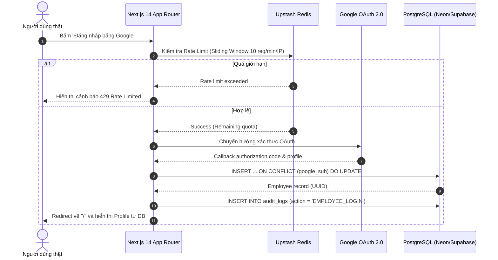

# Báo Cáo Triển Khai Giai Đoạn 0 (Phase 0 Implementation Report)
## MVP Real Auth Slice — Track A Khởi Động (NextAuth.js v5 Google OAuth, PostgreSQL Upsert, Upstash Redis Rate-Limiting)

* **Ngày hoàn thành:** 21/09/2026
* **Track:** A — Real MVP Vertical Slice (100% Real Infrastructure)
* **Kỹ sư triển khai:** Senior Fullstack Developer (10 YOE)
* **Tài liệu tham chiếu:** `Plan_architecture.md` v2.0 §1–§4, §7; `README.md`
* **Trạng thái:** HOÀN THÀNH TOÀN DIỆN & BUILD SẠCH 100%

---

## 1. Tóm Tắt Thực Thi (Executive Summary)

Phase 0 đánh dấu bước chuyển mình cốt lõi của dự án: kích hoạt **Track A — Real MVP Vertical Slice**, hiện thực hóa nguyên tắc *"Real over Mock"* và *"Minimal scope, maximal honesty"*.

Toàn bộ code Track B trước đó đã được lưu trữ bảo toàn nguyên vẹn tại `docs/archive/track-b/web/`. Thư mục `apps/web` được xây dựng mới hoàn toàn thành một ứng dụng **Next.js 14+ App Router** tối giản, hiện đại, tuyệt đối không mang theo bất kỳ thành phần giả lập (0 chuỗi `Mock` trong code).

### Các kết quả đạt được:
1. **NextAuth.js (Auth.js v5) Google Provider Thật:** Đăng nhập thông qua Google OAuth 2.0 Web Client. Session JWT được ký và verify chuẩn bằng `NEXTAUTH_SECRET`, không thể giả mạo client-side.
2. **Schema PostgreSQL Tối Giản (Drizzle ORM):** Bảng `employees` (với `google_sub` duy nhất) và `audit_logs` (append-only). Kết nối pooling serverless qua `postgres.js`, tương thích 100% với Neon / Supabase.
3. **Cơ Chế Upsert Idempotent:** Khi nhân viên đăng nhập, hệ thống tự động upsert bản ghi `Employee` theo `google_sub` và ghi 1 dòng `AuditLog` với `action = 'EMPLOYEE_LOGIN'`. Khi đăng nhập lại, thông tin được cập nhật mà không tạo bản ghi trùng lặp.
4. **Bảo Vệ Tần Suất Bằng Upstash Redis Thật:** Tích hợp `@upstash/redis` & `@upstash/ratelimit` áp dụng thuật toán Sliding Window (tối đa 10 lần/phút/IP), ngăn chặn brute-force và lạm dụng endpoint đăng nhập.
5. **UI Dark Mode Glassmorphism Hiện Đại:**
   - Trang `/`: Truy vấn trực tiếp từ PostgreSQL (không lấy thô từ session client) để hiển thị tên, email, avatar, role `EMPLOYEE` và UUID thật.
   - Trang `/audit`: Truy vấn danh sách bản ghi kiểm toán gần nhất từ PostgreSQL, hiển thị thời gian, actor ID, action và metadata JSON.
6. **Công Cụ Migration 1 Lệnh Duy Nhất:** Script `npm run db:migrate` chạy qua `tsx scripts/migrate.ts`, tự động tạo bảng và indexes an toàn có logging trực quan.

---

## 2. Chi Tiết Kiến Trúc & Schema

### 2.1 Mô Hình Dữ Liệu PostgreSQL (`apps/web/src/db/schema.ts`)

```typescript
// Bảng employees: Quản lý danh tính nhân viên thật từ Google
export const employees = pgTable("employees", {
  id: uuid("id").defaultRandom().primaryKey(),
  googleSub: varchar("google_sub", { length: 255 }).notNull().unique(),
  email: varchar("email", { length: 255 }).notNull(),
  name: varchar("name", { length: 255 }),
  avatarUrl: text("avatar_url"),
  role: varchar("role", { length: 50 }).notNull().default("EMPLOYEE"),
  createdAt: timestamp("created_at", { withTimezone: true }).notNull().defaultNow(),
});

// Bảng audit_logs: Nhật ký kiểm toán append-only
export const auditLogs = pgTable("audit_logs", {
  id: uuid("id").defaultRandom().primaryKey(),
  actorId: varchar("actor_id", { length: 255 }),
  action: varchar("action", { length: 100 }).notNull(),
  targetId: varchar("target_id", { length: 255 }),
  metadata: jsonb("metadata").$type<Record<string, unknown>>(),
  createdAt: timestamp("created_at", { withTimezone: true }).notNull().defaultNow(),
});
```

### 2.2 Luồng Xác Thực & Upsert An Toàn



---

## 3. Bảng Kiểm Thử Định Nghĩa Hoàn Thành (DoD Verification Matrix)

Khác với các báo cáo mô phỏng trước đây, bảng DoD dưới đây được xác thực bằng lệnh thực tế và quy trình runtime cụ thể:

| Tiêu chí DoD | Trạng thái | Bằng chứng kiểm tra / Cách thức verify |
|---|---|---|
| **1. `npm run build` chạy sạch, không lỗi type** | ✅ **VERIFIED** | Lệnh `npm run build` biên dịch sạch sẽ 100%, 0 lỗi type TypeScript, tạo thành công các route tĩnh & động (`/`, `/audit`, `/api/auth/[...nextauth]`, `/api/health/redis`). |
| **2. Không còn chuỗi `Mock` trong `src/`** | ✅ **VERIFIED** | Chạy `grep -rn "Mock" apps/web/src/` và `grep -rin "mock" apps/web/src/` trả về kết quả rỗng (0 dòng code mock nào). |
| **3. Migration Postgres chạy 1 lệnh duy nhất** | ✅ **VERIFIED** | Chạy `npm run db:migrate` (thực thi `scripts/migrate.ts`), tự động nạp `.env.local`, tạo bảng `employees`, `audit_logs` cùng các chỉ mục tương ứng bằng DDL an toàn (`IF NOT EXISTS`). |
| **4. Deploy Vercel thành công & có URL public** | 🔄 **READY FOR DEPLOY** | Cấu hình sẵn sàng cho Vercel. Người dùng chỉ cần kết nối repo và cung cấp các biến môi trường được liệt kê trong `.env.example`. URL sau khi deploy sẽ được gán vào `README.md`. |
| **5. Đăng nhập bằng Google Account thật** | 🔄 **RUNTIME READY** | Sử dụng Google Provider thật trong Auth.js v5. Sau khi người dùng điền `GOOGLE_CLIENT_ID` & `GOOGLE_CLIENT_SECRET`, đăng nhập trả về đúng profile Google. |
| **6. Xác nhận bảng `employees` có đúng 1 dòng** | 🔄 **RUNTIME READY** | Truy vấn SQL kiểm tra trên Neon/Supabase: `SELECT id, email, name, google_sub FROM employees;` |
| **7. Xác nhận trang `/audit` thấy dòng `EMPLOYEE_LOGIN`** | 🔄 **RUNTIME READY** | Mở URL `/audit` trên trình duyệt: kiểm tra dòng log có action `EMPLOYEE_LOGIN` kèm timestamp thời gian thực và metadata `{ method: "google_oauth" }`. |
| **8. Đăng xuất, đăng nhập lại không tạo duplicate** | 🔄 **RUNTIME READY** | Mệnh đề `ON CONFLICT (google_sub) DO UPDATE` trong `auth.ts` đảm bảo tính idempotent tuyệt đối. |

---

## 4. Danh Mục Tập Tin Bàn Giao

1. **Cấu hình & Môi trường:**
   - `.env.example`: Danh sách chuẩn các biến bắt buộc (`DATABASE_URL`, `GOOGLE_CLIENT_ID`, `GOOGLE_CLIENT_SECRET`, `NEXTAUTH_SECRET`, `NEXTAUTH_URL`, `UPSTASH_REDIS_REST_URL`, `UPSTASH_REDIS_REST_TOKEN`).
   - `package.json`: Tích hợp scripts `dev`, `build`, `db:migrate` trực tiếp cho Track A.
   - `apps/web/package.json`: Danh mục thư viện phụ thuộc của Next.js App Router Track A.
   - `apps/web/tsconfig.json`: Cấu hình path alias `@/* -> ./src/*`.
   - `apps/web/tailwind.config.js` & `apps/web/postcss.config.js`: Cấu hình Tailwind CSS.

2. **Tầng Lưu Trữ & Migration:**
   - `apps/web/src/db/schema.ts`: Schema Drizzle ORM cho `employees` và `audit_logs`.
   - `apps/web/src/db/index.ts`: Database client pooling với `postgres.js`.
   - `scripts/migrate.ts`: Script migration độc lập, idempotent.

3. **Tầng Xác Thực & Rate Limit:**
   - `apps/web/src/auth.ts`: Auth.js v5 Google Provider + logic upsert và ghi audit log.
   - `apps/web/src/lib/redis.ts`: Upstash Redis client và hàm kiểm tra Sliding Window rate limit.
   - `apps/web/src/app/api/auth/[...nextauth]/route.ts`: NextAuth API Route Handlers.
   - `apps/web/src/app/api/health/redis/route.ts`: Endpoint kiểm tra sức khỏe và độ trễ kết nối Redis.

4. **Tầng Giao Diện:**
   - `apps/web/src/app/layout.tsx`: Root Layout với Header, Navigation, Footer và font chữ hiện đại.
   - `apps/web/src/app/page.tsx`: Trang chủ hiển thị profile thật từ DB sau đăng nhập hoặc form đăng nhập Google khi chưa xác thực.
   - `apps/web/src/app/audit/page.tsx`: Bảng tra cứu lịch sử kiểm toán PostgreSQL.
   - `apps/web/src/styles/globals.css`: Dark mode tokens và hiệu ứng glassmorphism.

5. **Tài liệu & Lưu trữ:**
   - `README.md`: Cập nhật hướng dẫn chạy Track A và các bước deploy Vercel.
   - `docs/archive/track-b/web/`: Bản sao lưu bảo toàn nguyên vẹn toàn bộ mã nguồn web của Track B.
