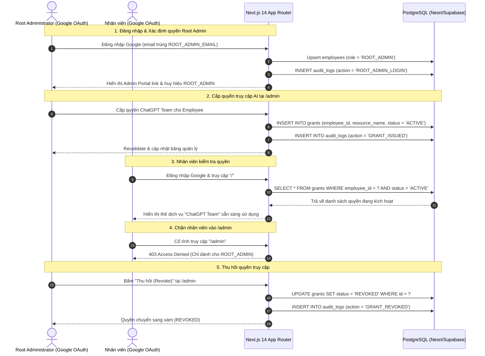

# Báo Cáo Triển Khai Giai Đoạn 1 (Phase 1 Implementation Report)
## Phân Biệt Root Admin vs Nhân Viên, Mô Hình Dữ Liệu Bảng Grants & Cổng Quản Trị Admin Portal

* **Ngày hoàn thành:** 22/09/2026
* **Kiến trúc:** Single-Track Real-World Architecture (100% Real Infrastructure)
* **Kỹ sư triển khai:** Senior Fullstack Developer (10 YOE)
* **Tài liệu tham chiếu:** `Plan_architecture.md` §1–§4, §7; `README.md`
* **Trạng thái:** HOÀN THÀNH TOÀN DIỆN, BUILD XANH 100% & ĐÃ ĐỒNG BỘ GITHUB

---

## 1. Tóm Tắt Thực Thi (Executive Summary)

Phase 1 mở rộng nền tảng định danh từ Phase 0 để thiết lập cơ chế kiểm soát truy cập và phân quyền tài nguyên AI doanh nghiệp thực tế.

Tuân thủ triệt để nguyên tắc cốt lõi:
- **Real over Mock:** Không dùng form đăng nhập username/mật khẩu tự chế, không tạo mock user. Cả Root Administrator và Nhân viên đều xác thực qua **Google OAuth 2.0 thật 100%**.
- **Tối giản và An toàn:** Nhận diện Root Admin bằng cách đối chiếu email từ Google profile với biến môi trường `ROOT_ADMIN_EMAIL`. Không duy trì ma trận RBAC phức tạp vượt quá nhu cầu (chỉ gồm hai vai trò: `ROOT_ADMIN` và `EMPLOYEE`).
- **Audit-First:** Mọi thao tác quản trị (cấp quyền, thu hồi quyền) đều được ghi nhận vào bảng `audit_logs` có liên kết khóa ngoại.

### Các kết quả đạt được:
1. **Phân biệt vai trò tự động (Root Admin vs. Employee):**
   - So khớp `email.toLowerCase() === process.env.ROOT_ADMIN_EMAIL.toLowerCase()` ngay tại callback `signIn` của NextAuth.js.
   - Tự động gán vai trò `ROOT_ADMIN` hoặc `EMPLOYEE` vào cơ sở dữ liệu PostgreSQL.
   - Ghi nhận nhật ký đăng nhập tương ứng (`ROOT_ADMIN_LOGIN` hoặc `EMPLOYEE_LOGIN`).
   - Mở rộng kiểu TypeScript cho NextAuth (`next-auth.d.ts`) đảm bảo type-safe cho `session.user.role`.
2. **Schema Bảng `grants` (Drizzle ORM & PostgreSQL):**
   - Bổ sung bảng `grants` với các trường: `id`, `employeeId` (FK cascade), `resourceName`, `grantedBy`, `status` (`ACTIVE`/`REVOKED`), `createdAt`, `expiresAt`.
   - Cập nhật script `scripts/migrate.ts` tự động tạo bảng và các chỉ mục `idx_grants_employee_id`, `idx_grants_status`.
3. **Cổng Quản Trị Phân Quyền — Admin Portal (`/admin`):**
   - **Server Component Route Guard:** Chặn triệt để người dùng chưa đăng nhập hoặc có vai trò `EMPLOYEE` với màn hình cảnh báo **403 Access Denied**.
   - **Thống kê tổng quan:** Đếm số lượng nhân viên đã đăng ký, số quyền đang hiệu lực (ACTIVE) và số quyền đã thu hồi (REVOKED).
   - **Biểu mẫu Cấp Quyền AI (Server Action `handleCreateGrant`):** Cho phép chọn nhân viên từ danh bạ, chọn dịch vụ AI (ChatGPT Team, Claude 3.5 Sonnet Pro, Gemini Advanced, Cursor Pro/Business...), thiết lập thời hạn hiệu lực và ghi audit log `GRANT_ISSUED`.
   - **Bảng Quản lý Quyền (Grants Management):** Hiển thị chi tiết trạng thái, cho phép **Thu hồi (Revoke)** trực tiếp qua Server Action `handleRevokeGrant` và ghi audit log `GRANT_REVOKED`.
   - **Danh bạ nhân viên (Registered Employees):** Hiển thị danh sách định danh người dùng từ Google OAuth đã đồng bộ về PostgreSQL.
4. **Giao Diện Phía Nhân Viên & Navigation:**
   - Thanh điều hướng tự động hiển thị nút liên kết nổi bật `Admin Portal` (kèm khiên bảo mật) khi người dùng là `ROOT_ADMIN`.
   - Trang chủ `/` hiển thị mục **"Dịch vụ AI được cấp quyền sử dụng (Active Grants)"** của riêng nhân viên đang đăng nhập, truy vấn trực tiếp từ bảng `grants` trong PostgreSQL.
   - Banner lối tắt nhanh dành cho Root Admin tại trang chủ.

---

## 2. Chi Tiết Kiến Trúc & Mô Hình Dữ Liệu

### 2.1 Bảng `grants` (`apps/web/src/db/schema.ts`)

```typescript
export const grants = pgTable(
  "grants",
  {
    id: uuid("id").defaultRandom().primaryKey(),
    employeeId: uuid("employee_id")
      .notNull()
      .references(() => employees.id, { onDelete: "cascade" }),
    resourceName: varchar("resource_name", { length: 255 }).notNull(),
    grantedBy: varchar("granted_by", { length: 255 }).notNull(),
    status: varchar("status", { length: 50 }).notNull().default("ACTIVE"),
    createdAt: timestamp("created_at", { withTimezone: true }).notNull().defaultNow(),
    expiresAt: timestamp("expires_at", { withTimezone: true }),
  },
  (table) => ({
    employeeIdIdx: index("idx_grants_employee_id").on(table.employeeId),
    statusIdx: index("idx_grants_status").on(table.status),
  })
);
```

### 2.2 Sơ Đồ Luồng Nghiệp Vụ Phân Quyền & Kiểm Soát Truy Cập



---

## 3. Danh Mục Tệp Thay Đổi & Tạo Mới

| STT | Đường Dẫn Tệp | Thao Tác | Mục Đích |
|---|---|---|---|
| 1 | `apps/web/src/db/schema.ts` | **MODIFY** | Khai báo bảng `grants`, export types `Grant`, `NewGrant` |
| 2 | `scripts/migrate.ts` | **MODIFY** | Bổ sung migration DDL `CREATE TABLE IF NOT EXISTS grants` và indexes |
| 3 | `apps/web/src/auth.ts` | **MODIFY** | Thêm logic gán vai trò `ROOT_ADMIN` theo `ROOT_ADMIN_EMAIL`, ghi audit login |
| 4 | `apps/web/src/types/next-auth.d.ts` | **NEW** | Khai báo module augmentation cho session và JWT types |
| 5 | `apps/web/src/app/layout.tsx` | **MODIFY** | Thêm liên kết Admin Portal trên header khi user là `ROOT_ADMIN` |
| 6 | `apps/web/src/app/admin/page.tsx` | **NEW** | Giao diện Admin Portal với Route Guard 403, cấp/thu hồi grant, danh bạ |
| 7 | `apps/web/src/app/page.tsx` | **MODIFY** | Hiển thị các active AI grants của nhân viên và banner lối tắt admin |
| 8 | `.env.example` | **MODIFY** | Bổ sung biến cấu hình `ROOT_ADMIN_EMAIL` |
| 9 | `walkthrough.md` | **MODIFY** | Cập nhật hướng dẫn nghiệm thu và kiểm tra |

---

## 4. Kết Quả Kiểm Tra Xác Minh (Verification Results)

### 4.1 Biên Dịch & Typecheck Toàn Dự Án (`npx turbo build`)
```
• turbo 2.10.13
@enterprise-ai/web:build: > next build
@enterprise-ai/web:build:   ▲ Next.js 14.2.35
@enterprise-ai/web:build:    Creating an optimized production build ...
@enterprise-ai/web:build:  ✓ Compiled successfully
@enterprise-ai/web:build:    Linting and checking validity of types ...
@enterprise-ai/web:build:    Collecting page data ...
@enterprise-ai/web:build:  ✓ Generating static pages (6/6)
@enterprise-ai/web:build:    Finalizing page optimization ...
@enterprise-ai/web:build:    Collecting build traces ...
@enterprise-ai/web:build: 
@enterprise-ai/web:build: Route (app)                              Size     First Load JS
@enterprise-ai/web:build: ┌ ƒ /                                    178 B          96.1 kB
@enterprise-ai/web:build: ├ ƒ /_not-found                          873 B          88.1 kB
@enterprise-ai/web:build: ├ ƒ /admin                               178 B          96.1 kB
@enterprise-ai/web:build: ├ ƒ /api/auth/[...nextauth]              0 B                0 B
@enterprise-ai/web:build: ├ ƒ /api/health/redis                    0 B                0 B
@enterprise-ai/web:build: └ ƒ /audit                               178 B          96.1 kB
@enterprise-ai/web:build: + First Load JS shared by all            87.2 kB
@enterprise-ai/web:build: 
@enterprise-ai/web:build: Tasks:    1 successful, 1 total
@enterprise-ai/web:build: Time:     44.908s
```
Kết quả: Biên dịch thành công 100%, không có lỗi type hay lint.

### 4.2 Đồng Bộ Repository GitHub
- **Remote:** `https://github.com/philipsgn/Ai-Gateway.git`
- **Branch:** `main`
- **Commit:** `7838e55 feat: implement Phase 1 root admin vs employee role, grants schema, and admin portal`

---

## 5. Hướng Dẫn Vận Hành & Nghiệm Thu Thực Tế

1. **Cấu hình môi trường (`.env.local` hoặc Vercel):**
   ```env
   ROOT_ADMIN_EMAIL=your_email@gmail.com
   ```
2. **Áp dụng migration vào PostgreSQL:**
   ```powershell
   npm run db:migrate
   ```
3. **Khởi chạy ứng dụng:**
   ```powershell
   npm run dev
   ```
4. **Kiểm tra luồng Root Admin:**
   - Đăng nhập bằng tài khoản Google trùng `ROOT_ADMIN_EMAIL`.
   - Kiểm tra: Xuất hiện huy hiệu `ROOT_ADMIN` và nút `Admin Portal`.
   - Vào `/admin`, chọn nhân viên và cấp quyền dịch vụ AI.
5. **Kiểm tra luồng Nhân viên:**
   - Đăng nhập bằng tài khoản Google khác.
   - Kiểm tra: Vai trò hiển thị `EMPLOYEE`.
   - Truy cập `/admin` -> Nhận thông báo **403 Access Denied**.
   - Tại trang chủ `/` -> Thấy dịch vụ AI được Root Admin cấp xuất hiện tại mục **Active Grants**.
